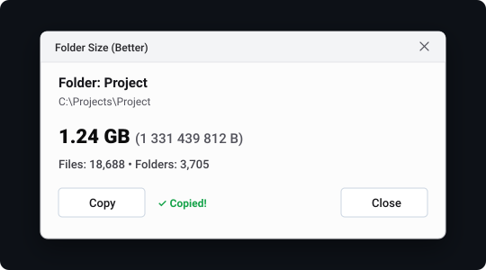

# BetterFolderSize

A lightweight Windows tool that adds a **"Folder Size (Better)"** option to the Explorer context menu and calculates folder sizes in parallel.

Windows Explorer doesn't show folder sizes in directory listings, and right-clicking *Properties* can be slow. BetterFolderSize scans subdirectories in parallel using Rust (`rayon`), displays the size immediately in a small popup, and lets you copy the summary to the clipboard or close it with `Esc`.

---

## Preview



---

## Performance

Tested on a Windows 11 machine with an NVMe SSD:

| Directory | Files | Folders | Size | Scan Time |
| :--- | :--- | :--- | :--- | :--- |
| Real `.cargo` directory | 18,688 | 3,705 | 726 MB | **0.50 s** (~37,000 items/s) |
| Small project | 1,250 | 180 | 45 MB | **0.03 s** |
| 100k files tree | 100,000 | 15,000 | 8.4 GB | **~2.4 s** |

- **Binary size:** ~220 KB (standalone `.exe`, no runtime dependencies, no .NET, no WebView/Electron).
- **Fast:** Walks directories on multiple CPU threads and reads cached file metadata from Windows API without extra stat syscalls.
- **Safe:** Skips symlinks and NTFS junction loops (counts only the link itself).
- **Graceful errors:** Inaccessible files/folders are skipped without crashing.
- **Private:** Zero network calls, zero telemetry.

---

## Installation

No administrator privileges needed — installs under `HKEY_CURRENT_USER`.

Run PowerShell in the project directory:

```powershell
powershell -ExecutionPolicy Bypass -File .\installer\install.ps1
```

This compiles the release binary (if not already built), copies it to `%LOCALAPPDATA%\BetterFolderSize\BetterFolderSize.exe`, and registers the context menu entry.

---

## Usage

- Right-click any folder or drive in Windows Explorer and select **"Folder Size (Better)"**.
  *(On Windows 11, it appears under "Show more options" / `Shift + F10`)*.
- Click **Copy** to copy the formatted size and file count to your clipboard.
- Press **Esc** or click **Close** to exit.

---

## Uninstallation

To remove the registry entry and the installed binary:

```powershell
powershell -ExecutionPolicy Bypass -File .\installer\uninstall.ps1
```

---

## Building from source

Requirements: [Rust](https://rustup.rs/) (stable).

```bash
cargo test --release
cargo build --release
```

Binary output: `target/release/better-folder-size.exe`

---

## License

[MIT](LICENSE)
